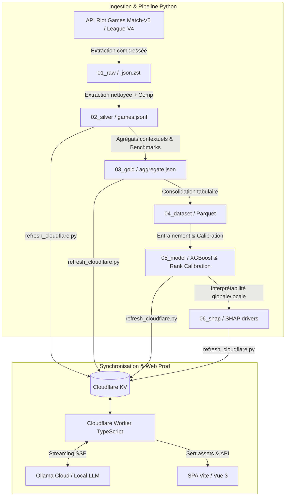

# RiftSense 🎯 — Coach IA & Pipeline Data/ML pour League of Legends

[](https://github.com/JeanVG23/riftsense/actions/workflows/ci.yml)
[](https://www.python.org/)
[](https://python-poetry.org/)
[](https://workers.cloudflare.com/)
[](https://xgboost.readthedocs.io/)
[](https://www.typescriptlang.org/)
[](https://opensource.org/licenses/MIT)

> **Un coach IA personnalisé centré sur les décisions du joueur, le macro-positionnement et l’enchaînement temporel des événements, benchmarké par rapport aux données réelles de joueurs Challenger / Master.**

---

## ▶️ Essayer en deux commandes

```bash
poetry install
make demo
```

Aucune clé API, aucun accès réseau, rien à configurer. `make demo` rejoue la chaîne
complète sur **49 parties réelles pseudonymisées** versionnées dans
`tests/fixtures/demo/` :

| étape | ce qui tourne | ce que ça montre |
|---|---|---|
| 1 | `pipeline_ops/reextract_silver.py` | raw compressé → 274 records silver, 0 appel API |
| 2 | `pipeline_ops/rebuild_gold.py` | agrégats benchmarkés, facettes victoire/défaite |
| 3 | `reporting/compare.py` | verdict chiffré perso vs Challenger, à issue égale |
| 4 | `04_coaching/coach.py --game` | payload → schéma → review validée |
| 5 | `04_coaching/grounding.py` | taux d'ancrage de la review qui vient d'être produite |

Ce sont les scripts de production, pas une démo parallèle : la seule pièce
remplacée est l'appel au modèle (`--mock-llm`, générateur déterministe qui relit le
payload). Les données de démo atterrissent dans `.demo/`, jetable ; `data/` n'est
jamais touché. La chaîne complète est verrouillée par `tests/test_demo.py`.

> Les fixtures sont des parties réelles dont tout identifiant Riot a été remplacé
> par un jeton déterministe (`puuid`, `summonerId`, identifiant de partie, pseudo).
> La pseudonymisation est régénérable (`make fixtures`) et **vérifiée à chaque
> exécution des tests**, pas seulement au moment où elle a été faite.

---

## 🌟 Pourquoi ce projet ?

Les outils d'analyse traditionnels de League of Legends (OP.GG, U.GG, Porofessor) reposent quasi exclusivement sur des **agrégats naïfs** (KDA, CS/min, dégâts bruts, taux de victoire). Ces métriques mènent trop souvent à des conseils creux ou erronés (*« meurs moins »*, *« farme plus »*).

**RiftSense** prend le contre-pied :
1. **Positionnement > Stats brutes** : Une analyse temporelle précise (à partir de la timeline Riot Match-V5) des déplacements, du timing de recall, de la proximité aux objectifs et de l'isolement apporte un signal bien plus déterminant qu'un simple score KDA.
2. **Respect strict de l'asymétrie d'information** : Le coach ne reproche **JAMAIS** une décision sur la base d'une information que le joueur n'avait pas (fog of war). Les features sont scindées entre métriques fiables pour le coaching (`COACHING_SAFE`) et proxies de vision réservés au ML (`ML_ONLY`).
3. **Benchmarks comparatifs High-Elo** : Tout diagnostic est contextualisé par rapport à des dizaines de milliers de parties Challenger et Master à issue équivalente (victoire vs défaite, matchup botlane, exposition aux ganks).
4. **Analyse temporelle post-mort** : Chaque mort est rapprochée mécaniquement des événements objectifs observés ensuite (bâtiments perdus, drakes/barons cédés, swing de gold d'équipe dans les 60 à 90 secondes suivantes), sans prétendre démontrer qu'elle les a causés.
5. **Restitution structurée par LLM** : Le modèle de langage ne fait pas de calculs "au doigt mouillé" ; il reçoit un **payload pré-agrégé et vérifié**, et produit une analyse narrative structurée (forces, erreurs étayées par des preuves chiffrées, habitudes à corriger, focus prioritaire).

---

## 🏗️ Architecture Globale

Le projet repose sur une **architecture Médaillon** en Python (pour l'extraction, l'ingénierie des données et le ML) couplée à une **application web Cloudflare Worker** (TypeScript + KV + Vite + Vue Router) pour la restitution web en temps réel. **Aucun backend FastAPI ne tourne en production** : le calcul lourd est fait en amont en Python local et synchronisé dans Cloudflare KV, ce qui permet au Worker de servir l'API et les pages avec une empreinte CPU minimale (< 10 ms).



---

## 📂 Organisation du Dépôt & Médaillon

```text
riftsense/
├── src/
│   ├── core/                  # Socle partagé (client Riot, positionnement, journal, features, inférence de rang)
│   ├── collection/            # Scripts de scraping, densification et sync Cloudflare
│   ├── pipeline_ops/          # Maintenance médaillon (re-extraction, rebuild, zstd, audits)
│   ├── reporting/             # Comparateur heuristique de profils vs référentiels
│   ├── 01_data_engineering/   # Construction des tables ML Parquet
│   ├── 02_data_science/       # Modèles de classification de rang, régression LP, calibration
│   ├── 03_data_analyse/       # Analyse d'impact SHAP / Explainability
│   └── 04_coaching/           # Génération des prompts, validation Pydantic et client LLM
├── data/                      # Stockage des couches de données (gitignoré sauf statiques)
│   ├── 00_static/             # Caractéristiques des champions et validation d'axes
│   ├── 01_raw/                # Matchs bruts Riot compressés en Zstandard (.json.zst)
│   ├── 02_silver/             # Jeux de données nettoyés par joueur / référentiel
│   ├── 03_gold/               # Agrégations de benchmark par rôle, champion et contexte
│   ├── 04_dataset/            # Datasets Parquet prêts pour le machine learning
│   ├── 05_model/              # Modèles entraînés (.pkl) et métriques de calibration
│   └── 06_shap/               # Explications SHAP locales et globales
├── config/                    # accounts.json (ignoré) et son gabarit accounts.example.json
├── web/
│   └── cf/                    # paquet Vite + Worker Cloudflare
│       ├── client/            # SPA Vue 3, pages et composants TypeScript
│       ├── public/            # assets statiques
│       └── src/               # API, KV & SSE de production
└── tests/                     # Suite de tests automatisés pytest & vitest
```

---

## 🔬 Fonctionnalités Clés & Méthodologie

### 1. Ingestion Riot & Compression Zstandard
- Utilisation de **Match-V5 + Timeline** pour capturer chaque événement discret et l'échantillonnage 60s des 10 champions.
- Compression transparente en `.json.zst` permettant de stocker des milliers de parties complètes (~10 Go brut $\rightarrow$ ~750 Mo).
- Rate-limiting adaptatif et routage automatique (régional pour Account/Match, plateforme pour League/Rank).

### 2. Macro-Positionnement & Respect de l'Asymétrie
- **14 features `COACHING_SAFE`** : Distance médiane aux alliés, distance d'isolement, temps passé en base, timing de reset, gold non dépensé moyen avant recall, proximité aux drakes et barons avant spawn...
- **3 features `ML_ONLY`** (proxies de vision) : Utilisées uniquement par les modèles prédictifs, jamais reprochées au joueur afin d'éviter tout biais omniscient.
- **Contexte de Lane & Matchup** : Classification automatique de la composition botlane (`poke`, `all_in`, `scaling`, `mixed`) et calcul de l'exposition aux ganks (`low`, `med`, `high`).

### 3. Machine Learning & Estimation de Rang
- **Classification de niveau** : Prédiction probabiliste du rang effectif (High Elo Challenger/Master vs Low Elo) entraînée sur les profils agrégés de joueurs (`build_player_dataset.py`, ensemble XGBoost / Random Forest / EBM).
- **Régression de LP** : Modèle calibré estimant le niveau en League Points continus.
- **Interprétabilité SHAP** : Extraction des leviers de progression spécifiques au joueur (SHAP values indiquant précisément quelles habitudes freinent la montée en elo).

### 4. Restitution LLM Fiabilisée & Streaming SSE
- Payload rigoureusement formaté contenant les signaux statistiques et le contexte de jeu.
- Sortie contrainte par un **schéma JSON strict** :
  - `strengths` (3 points forts avec preuves chiffrées).
  - `mistakes` (3 erreurs clés avec preuves chiffrées).
  - `habits` (2 axes récurrents à corriger).
  - `next_focus` (1 objectif actionnable pour la prochaine partie).
- Diffusion en direct vers le frontend via **Server-Sent Events (SSE)**.
- **Boucle de feedback** intégrée pour évaluer l'utilité des recommandations générées.

### 5. Évaluation du LLM (harness, pas impressions)
- **Critère de succès posé à l'avance** : ≥70 % d'erreurs jugées utiles sur ≥10 analyses par-partie annotées.
- **Annotation insight par insight** (utile/faux + tag de rejet parmi une liste fermée + note libre), en CLI (`feedback.py annotate --pending`) ou depuis le site, les deux écrivant le même format.
- **Traçabilité de chaque run** : la review persistée porte sa version de prompt (empreinte dérivée du texte, pas un numéro à bumper), son modèle, sa latence, ses tokens et son coût estimé, retries de schéma compris. Sans cette trace, une variation du taux n'est attribuable ni au prompt ni au modèle.
- **Contrôles automatiques, sans humain** : `grounding.py` vérifie que chaque chiffre et chaque horodatage cités existent dans le payload (indexation par unité, sinon n'importe quel nombre du journal ancrerait n'importe quelle stat), et `counterfactual.py` perturbe une dimension du payload puis régénère pour vérifier que la sortie suit. Le détecteur d'ancrage est lui-même calibré par contrôle négatif : on falsifie des chiffres réels et on mesure le taux de rejet.
- **Taux publié en continu** : `GET /api/c/<slug>/eval` recalcule la métrique à la lecture (les votes laissés depuis le site comptent immédiatement) et le site l'affiche, atteint ou non. Seuils verrouillés entre les deux runtimes par `tests/test_eval_parity.py`.

---

## 🚀 Installation & Démarrage Rapide

### Prérequis
- **Python 3.13+** avec [Poetry](https://python-poetry.org/)
- **Node.js 20+** et `npm`
- Une clé API Riot Games ([Riot Developer Portal](https://developer.riotgames.com/))

### 1. Cloner le projet & Installer les dépendances

```bash
git clone https://github.com/JeanVG23/riftsense.git
cd riftsense

# Installer l'environnement Python
poetry install

# Installer les dépendances du Worker Cloudflare
cd web/cf
npm install
cd ../..
```

### 2. Configuration des variables d'environnement

Copiez le fichier d'exemple et renseignez vos identifiants :

```bash
cp .env.example .env
```

Variables requises dans `.env` :
```env
RIOT_API_ID=RGAPI-xxxxxxxx-xxxx-xxxx-xxxx-xxxxxxxxxxxx
RIOT_ID=MonPseudo#EUW
RIOT_REGION=euw1

# Pour la synchronisation Cloudflare KV (optionnel en local)
CF_API_TOKEN=votre_token_cloudflare
CF_ACCOUNT_ID=votre_account_id
CF_NAMESPACE_ID=votre_kv_namespace_id

# Pour le coaching LLM
OLLAMA_API_KEY=votre_cle_ollama
```

---

## 💻 Utilisation & Commandes Principales

### Pipeline de Données & Orchestration

Le pipeline est un **graphe de dépendances déclaré dans le `Makefile`**, pas une suite
d'appels à lancer dans le bon ordre de tête. Chaque étape dépend des artefacts qu'elle lit
**et du code qui la produit** : toucher `src/core/positioning.py` périme le silver, donc le
gold, donc les datasets, donc les modèles. Sans cette arête, on sert un modèle entraîné sur
des features qui n'existent plus, et rien ne le signale.

```bash
make graph      # le graphe
make plan       # ce qui est périmé et serait relancé (ne lance rien)
make pipeline   # ne recalcule que le périmé
```

```
01_raw (collecte Riot, hors make)
  └─ reextract_silver ──> 02_silver
       ├─ rebuild_gold ──> 03_gold ──> compare / payload coaching
       └─ build_dataset ──> adc_dataset.parquet
            ├─ build_player_dataset ──> adc_player_dataset.parquet
            └─ build_player_lp_dataset ──> adc_player_lp_dataset.parquet
                 (+ apex_lp.json, `make lp-label`)
                      └─ build_split ──> split.json
                           ├─ train_player_ensemble ──> *_player_highelo.pkl
                           │    └─ calibrate_player_rank
                           └─ train_player_lp ──> *_player_lp.pkl
```

**Les étapes réseau ne sont jamais des dépendances.** La collecte Riot, le label LP et la
publication Cloudflare sont des cibles explicites : `make pipeline` ne peut pas consommer de
quota d'API ni publier quoi que ce soit par effet de bord. Un test le vérifie
(`tests/test_pipeline_graph.py`), parce que c'est exactement le genre d'arête qu'on ajoute
sans y penser.

```bash
make collect RANKS=challenger,grandmaster PLAYERS=200 ROUNDS=5   # collecte Riot
make lp-label                                                    # label LP (apex)
make sync                                                        # dry-run Cloudflare
make sync-push                                                   # publication réelle
make report                                                      # état des datasets
```

`make collect` remplace les deux boucles bash `for i in {1..5}; do … sleep 10; done` qui
tenaient lieu d'ordonnanceur : mêmes appels, mais les paramètres sont des variables et non
des constantes recopiées dans deux fichiers. La pause reste une politesse envers l'API ; le
rate-limiter, lui, vit dans `riotlib`.

> ⚠️ **Ce qui n'est pas orchestré, et pourquoi.** La collecte tourne en local : elle a besoin
> de la clé Riot et écrit ~10 Go de raw compressé. La faire tourner dans un runner GitHub
> serait une mise en scène. Le cron hebdomadaire (`.github/workflows/weekly.yml`) porte donc
> sur ce qui a du sens à distance : il **résout les dépendances sans le lock** et rejoue
> `make demo` de bout en bout, pour apprendre qu'une version de pandas casse la chaîne avant
> le jour où il faut mettre à jour.

### Lancement de l'Application Web

L'application web s'exécute via le **Worker Cloudflare TypeScript** (`web/cf/`) qui sert l'API sous `/api/*`, le binding KV (`DATA`) et le frontend construit par Vite (`web/cf/client/`) :

```bash
cd web/cf

# Lancement en local avec lecture des données Cloudflare KV distantes :
npm run dev
```

L'application est accessible en local sur `http://localhost:8787` (et déployée en production sur `https://riftsense.jeanvg.fr`).

> ℹ️ **Note d'architecture** : L'ancien backend Python/FastAPI (`web/backend/`) hérité de l'hébergement Fly.io a été **supprimé** (l'historique git le conserve). Le site et l'API tournent exclusivement sur Cloudflare Worker TypeScript. Les trois modules qui n'étaient pas du serving et qui restent utilisés par la collecte locale ont été déplacés : `ml_rank.py` et `settings.py` dans `src/core/`, `pipeline.py` dans `src/collection/`.

---

## 🧪 Tests & Assurance Qualité

Le projet intègre une suite de tests unitaires et de cohérence pour garantir la parité stricte entre les pipelines Python et TypeScript :

```bash
# Tout d'un coup
make test && make lint

# Ou commande par commande — les tests Python (pytest)
poetry run pytest tests/web/
poetry run pytest tests/

# Linter Python
poetry run ruff check .

# Lancer les tests TypeScript (vitest)
npm test --prefix web/cf

# Vérification du typage TypeScript
npm run --prefix web/cf typecheck
```

Ces quatre commandes sont exactement celles que joue la CI GitHub Actions
(`.github/workflows/ci.yml`) à chaque push et chaque pull request. La CI installe le
socle sans `torch` (`poetry install --without deep`) : les tests du transformer
séquentiel se sautent alors d'eux-mêmes.

Ruff applique aussi un garde-fou de complexité cyclomatique (`C901`) : toute fonction
dépassant un score McCabe de 20 fait échouer la CI. Le seuil porte sur tout le dépôt et
n'utilise aucune exemption locale.

Les tests qui ont besoin d'une pile de données complète, eux, ne se sautent plus :
ils la construisent depuis `tests/fixtures/demo/` (fixture `demo_data`). Les sept
goldens de parité `payload.py` ↔ `readers.ts` s'exécutaient auparavant chez le
mainteneur uniquement, faute de `data/` en CI, et un test sauté est vert sans avoir
rien vérifié. Adossés aux fixtures, ils ont immédiatement révélé une divergence
réelle : côté Python, l'ordre des morts par zone × phase dépendait du hachage des
chaînes, donc du `PYTHONHASHSEED`, alors que le TypeScript partait de clés triées.

> ⚠️ Sur macOS, `torch` et `xgboost` ne cohabitent pas dans le même processus (double
> chargement de `libomp`, segfault). Lancer la suite complète avec `torch` installé
> peut donc planter en local, sans que ce soit un échec de test. Voir la même note
> côté entraînement séquentiel (`--device cpu`).

---

## 🔒 Confidentialité & Hygiène des Données

- **Pas de données brutes versionnées** : Les fichiers volumineux de timeline (`data/01_raw/`, `data/02_silver/`, etc.) ainsi que les fichiers d'environnement `.env` sont strictement exclus par `.gitignore`.
- **Fixtures de test anonymisées** : `tests/web/fixtures/` contient des fixtures synthétiques minimales pour les endpoints de l'API et les parsers. `tests/fixtures/demo/` (cf. `make demo`) contient à l'inverse de **vraies parties**, pseudonymisées : identifiants opaques (`puuid`, `summonerId`, identifiant de partie) remplacés partout par balayage récursif, pseudonymes remplacés aux seuls champs qui les portent — un joueur peut s'appeler « Aatrox », et un remplacement global réécrirait le `championName` de toutes les parties. `tests/test_demo.py` échoue si un identifiant réel réapparaît.
- **Gestion des comptes** : `config/accounts.json` n'est pas versionné — les comptes suivis sont des données personnelles. Copiez `config/accounts.example.json` pour créer le vôtre ; à défaut, la chaîne démarre sur l'exemple.

---

## 📜 Licence

Ce projet est sous licence [MIT](LICENSE).
